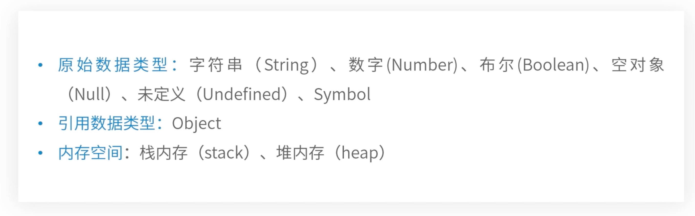

##### 一、数据类型

##### 二、js内存

1.搞清楚原始类型和引用类型的区别，该思想影响着后面的浅拷贝和深拷贝

2.原始数据类型在栈内存，引用数据类型在堆内存

##### 三、栈内存

1.变量声明赋值会产生开辟内存空间以及**入栈出栈**过程

2.在JavaScript中，**原始数据类型的值都有固定的大小**存放在栈内存中，由系统自动分配内存空间，所以我们可以直接访问

3.原始数据类型都放在栈内存中，都是**按值访问**（非地址访问）

4.栈，一种运算受限的线形表，其限制是只允许在**表的一端**插入和删除运算。我们的栈**只能从栈顶插入和删除数据**，跟生活中的水桶一样。

5.第一个被声明的原始类型被放在**栈底**，以此类推向上入栈

6.而定义变量的过程是：比如var a = 10; 一开始将原始类型的数字类型10放入栈内存中。其次放入a，a此时默认是undefined。当声明变量名以后我们才开始赋值，而赋值的过程只是**数据类型与其变量名关联起来**。当关联完成以后，我们定义变量的过程才叫结束

7.删除一个元素叫出栈或者是退栈，遵循**先进后出**的原则。先删除**栈顶**元素，使其相邻的元素成为新的栈顶元素

##### 四、堆内存

1.在JavaScript中，**引用类型值的大小是不固定**的并在堆内存中存储

2.**JavaScript是不允许直接访问堆内存的**，因此无法直接操作对象的堆内存空间。那么我们在操作对象时，**实际是操作对象的引用地址**，而不是实际的对象

3.引用类型的值都是按引用访问的。这里的**引用**我们可以理解为：**保存在栈内存中的内存地址，该地址与堆内存的实际值相关联**

4.**引用类型的值是保存在堆内存中的对象**

5.另外**函数**，会将函数体以字符串的形式存储在堆内存当中，这块空间会有个16进制的地址交给栈内存与函数变量名关联起来，此时的函数仍然以字符串的形式存放在堆内存当中。当执行时会找到堆内存中的函数体的字符串并转化为js执行。如果不执行，就继续躺在堆内存当中。