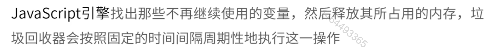
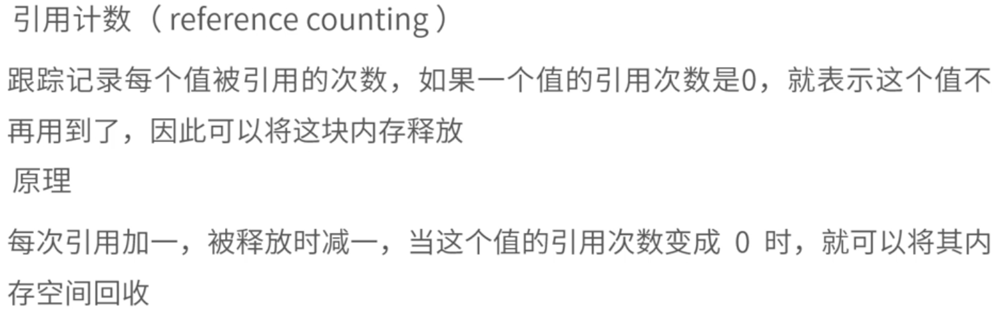
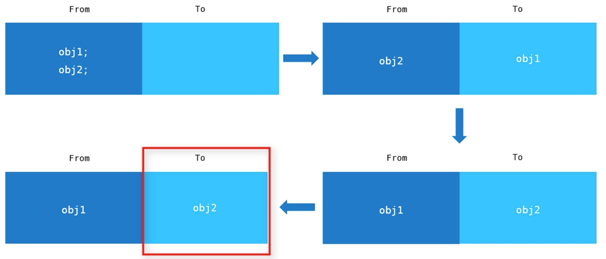
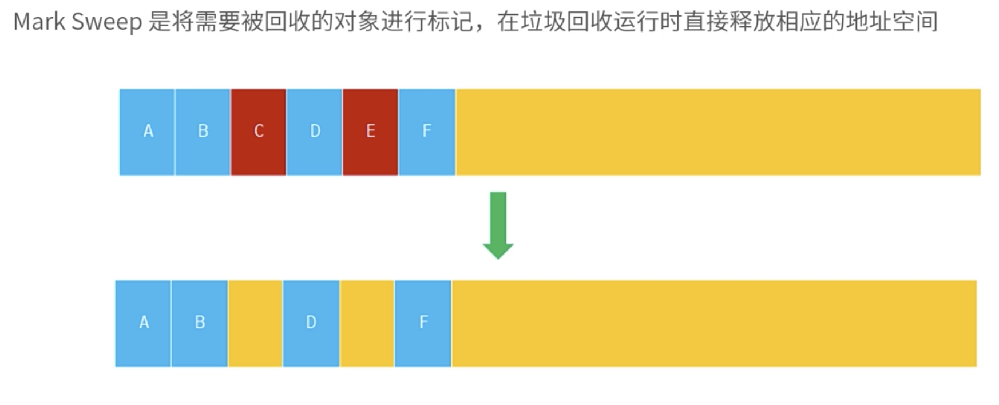
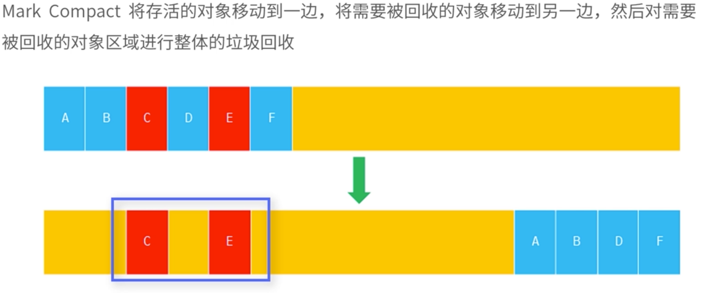

#### 一、垃圾回收机制

##### 1.垃圾回收方式1:引用计数

##### 2.垃圾回收方式2:标记清除

1.变量进入执行环境会被标记为：进入环境

2.变量离开执行环境会被标记为：离开环境

#### 二、V8内存管理机制:新生代和老生代

V8是开源高性能JavaScript引擎，被用于谷歌，安卓，node等大型项目

##### 1.新生代垃圾回收

1.1 From为使用空间，to为闲置空间

1.2 垃圾回收机制会处理闲置的对象

##### 2.老生代垃圾回收

老生代有两种回收方式

2.1标记清除

2.2 标记合并

