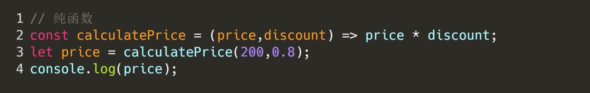
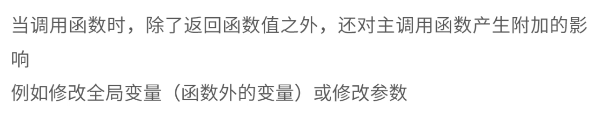
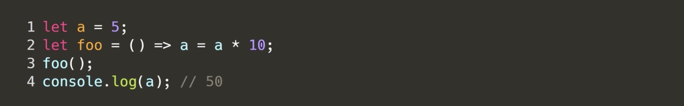
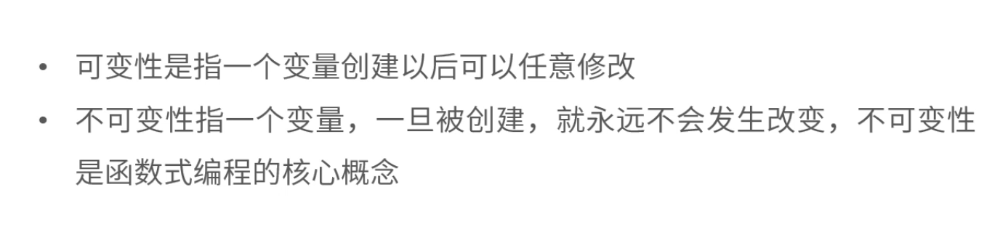

## 一、函数式编程思想

### 1. 命令式编程

详细的命令机器怎么去处理一件事情以达到你想要的结果

```javascript
// 让数组的每一项加 1
// 初级程序员
let arr = [1,2,3,4];
let newArr=[];
for (var i = 0; i < arr.length; i++){
	newArr.push(arr[i]+1);
}
console.log(newArr);

// 初级到中级之间
let arr =[1,2,3,4]
let newArr = arr =>{
  let res = [];
  for( let i = 0; i < arr.length; i++){
    res.push(arr[i]+1)
  };
  return res
}
console.log(newArr(arr))
```

### 2. 函数式编程

定义：将我们程序分解为一些更可重用、更可靠且更易于理解的部分，然后再将它们组合起来，形成一个更易于推理的程序整体

目的：提高代码的可靠性

方式：组合式，将我们复杂的函数组装成简单的函数，将运算过程尽量写成简单的函数调用

```js
let arr = [1, 2, 3, 4];
let newArr = (arr, fn) => {
  let res = [];
  for (let i = 0; i < arr.length; i++) {
    res.push(fn(arr[i]));
  }
  return res;
}
let add = item => item + 5;
let multi = item => item * 5;
// 相同的输入，永远会得到相同的输出
let sum = newArr(arr, add);
// 相同的输入，永远会得到相同的输出
let product = newArr(arr,multi);
console.log(sum);
console.log(product);
```

## 二、纯函数

1. 定义：


2. 相同的输入，永远会得到相同的输出，没有副作用。




## 三、非纯函数

1. 相同的输入，不一定得到相同的输出


## 四、函数副作用

1. 定义：






2. 解决方案一（依赖注入）

   首先，fooA违背了纯函数的定义：相同的输入会得到相同的输出结果

   目的：为了控制不确定性，把不确定性移动到更小的函数中

   2.1 把不纯的地方提取出来

   2.2 让不纯的代码远离核心代码

   2.3 让foo函数变纯函数

   ```js
   //
   const fooA = (something) => {
     const dt = new Date().toISOString();
     console.log(`${dt}:${something}`);
           }
   fooA('hello')
   
   //上下比较
   
   const fooB = (d, log, something) => {
     const dt = d.toISOString();
     return log(`${dt}: ${something}`);
   }
    
   const something = '你好网易';
   const d = new Date();
   const log = console.log.bind(console);
   fooB(d,log,something);
   ```

   

3. 解决方案二（保证函数无副作用的特性）


## 五、可变性和不可变性

1.定义



2.解决可变性：通过深拷贝对方法

​	2.1 通过`扩展运算符{...}`去深拷贝，但是扩展运算符只能深拷贝第一层

​	2.2 也可通过`JSON.stringify()`把对象或数组转化为字符串使之在栈内存里开辟空间(深拷贝)，然后通过`JSON.parse()`把字符串转化为一个对象在堆内存里开辟地址(浅拷贝)
