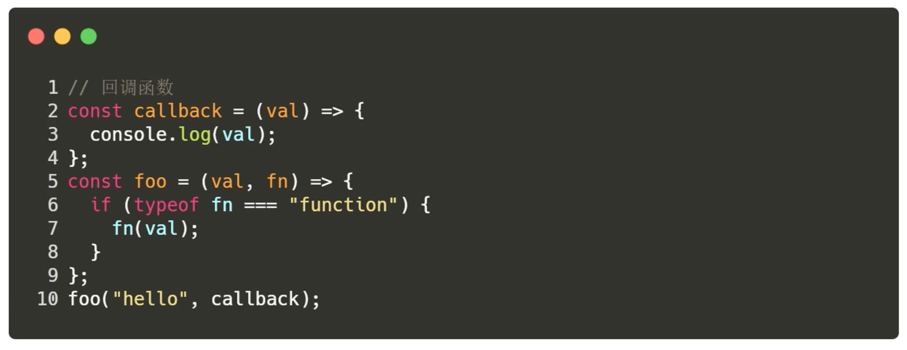

#### 一、高阶函数

定义：


```js
// 对数组的每一项进行操作
// map 对数组每一个项元素的操作
const arr = [1, 2, 3, 4, 5];
const arr3 = arr1.map(function (item, index, arr) {
  // console.log(item,index,arr);
  return item * 2;
});

console.log(arr3);
const arr4 = arr1.map((item) => item * 2);
console.log(arr4);

// reduce 对数组前后元素/上一次结果的操作 （去重、累加、比较大小）
let arr1 = [1, 2, 3, 4, 5, 5, 5, 5, 6, 4];
let arr2 = [1, 2, 3, 4, 5];
let sum = arr2.reduce((prev, cur) => {
  return prev + cur;
}, 0);

console.log(sum);

let newArr = arr1.reduce((prev, cur) => {
  prev.indexOf(cur) === -1 && prev.push(cur);
  return prev;
}, []);
console.log(newArr);

// filter 过滤返回满足条件的一项
let persons = [
  { name: "Peter", age: 21 },
  { name: "Mark", age: 28 },
  { name: "Josn", age: 19 },
  { name: "Jane", age: 31 },
  { name: "Tony", age: 35 },
];
let newAge = persons.filter((item) => item.age > 21);
console.log(newAge);

// flat 数组扁平化，将多维数组变为一维数组
let arr = [1, 2, 3, 4, [5, 6, [7, 8, [9, 10, [11, 12, [13, 14]]]]]];
let arr1 = arr.flat(Infinity);
console.log(arr1);
```

#### 二、高阶函数的实际作用

高阶函数不是Javascript的专利，但绝对是Javascript的编程利器

高阶函数是对基本算法的再度抽象，利用这一点编写重用更高、更简洁的代码


