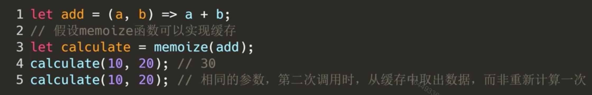
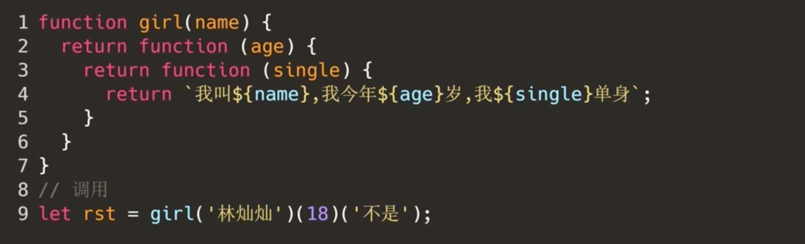
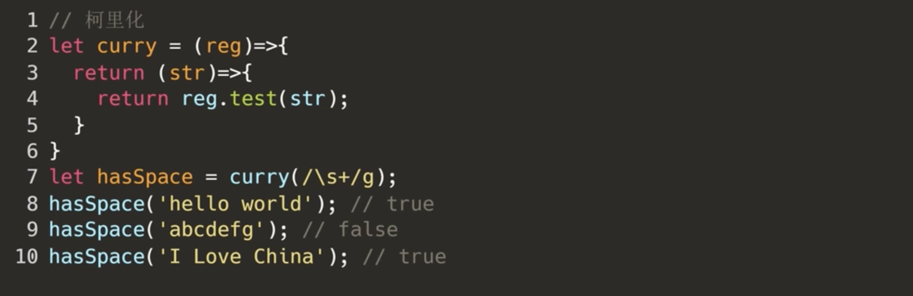

# 常用函数

##### 一、缓存函数


需要大量重复计算，或者大量计算又依赖于之前的结果



```js
let memoize = function (func) {
            let cache = {};
            return function (key) {
                if (!cache[key]) {
                    cache[key] = func.apply(this, arguments);
                }
                return cache[key];
            }
        }

let add = (a, b) => a + b;
        let calculate = memoize(add);
//代码不完全具有代表性
        console.log(calculate(10, 20));
        console.log(calculate(20, 30));
```


##### 二、柯里化函数（curry）







##### 三、Lodash


四、偏函数