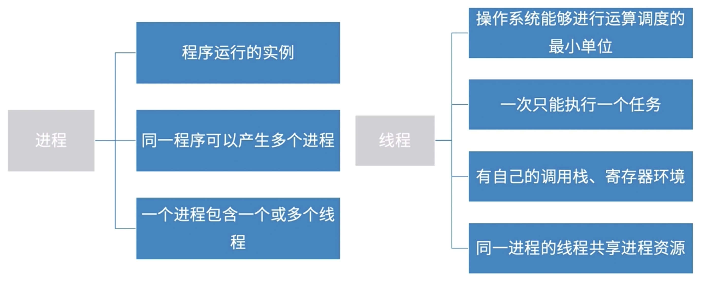
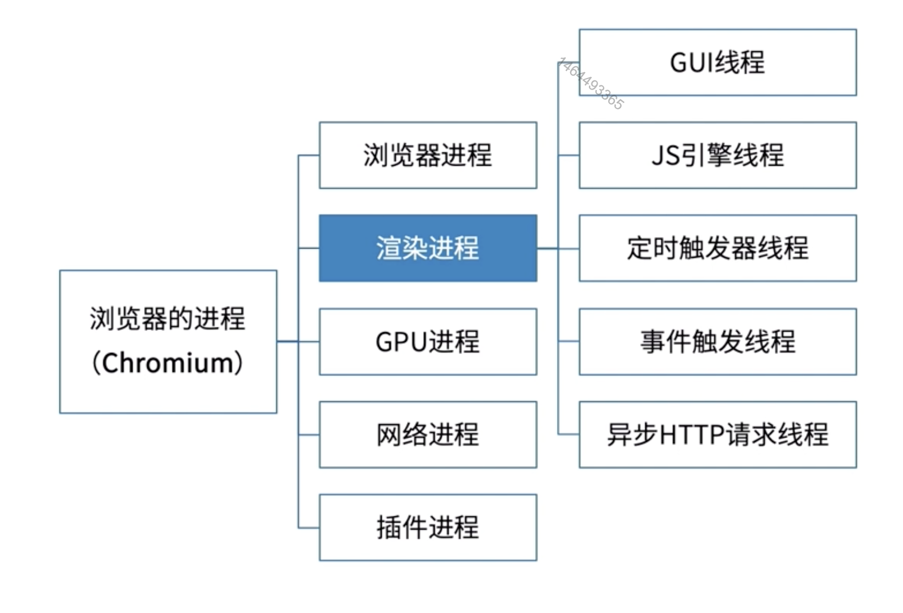
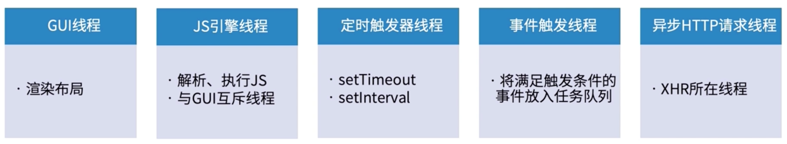
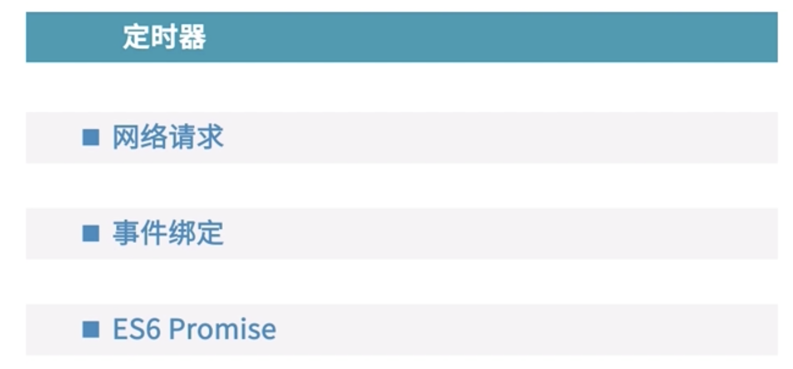

# 同步与异步

##### 1.概念

##### 2.js异步是如何实现的

答：js异步是通过`浏览器内核多线程`实现异步

2.1 首先，我们要搞清楚两个概念：[进程和线程](https://www.ruanyifeng.com/blog/2013/04/processes_and_threads.html )。

2.2 查看进程变化的常用Linux命令

ps：静态进程查看

top：动态进程查看

2.3 [浏览器是多进程架构](https://juejin.im/post/5bd7c761518825292d6b0217)

GUI：负责渲染页面，解析html、css，构建dom树

JS引擎：解析、执行js程序（v8引擎就跑在JS引擎线程里）

⚠️：JS也是可以操作dom的，当GUI和js引擎同时执行会造成混乱，且当js操作dom的时间过长，还会导致浏览器渲染时间过长

2.4 异步场景

