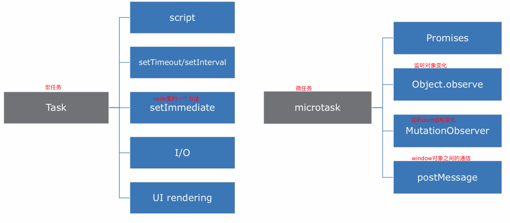
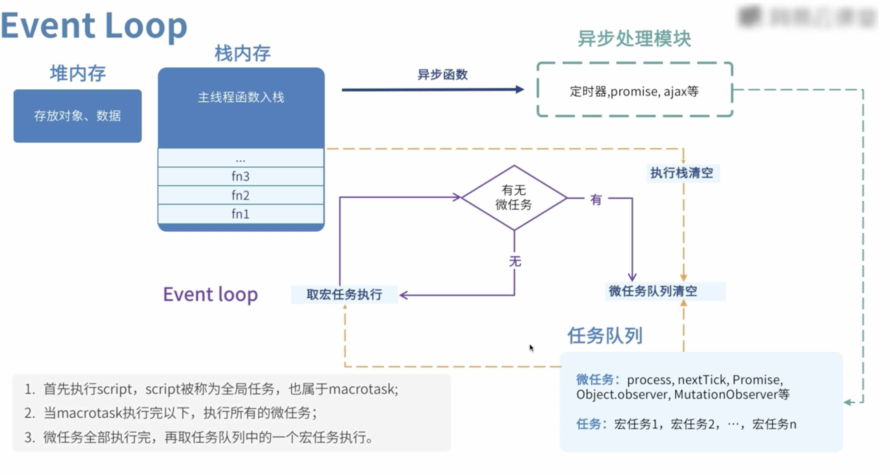
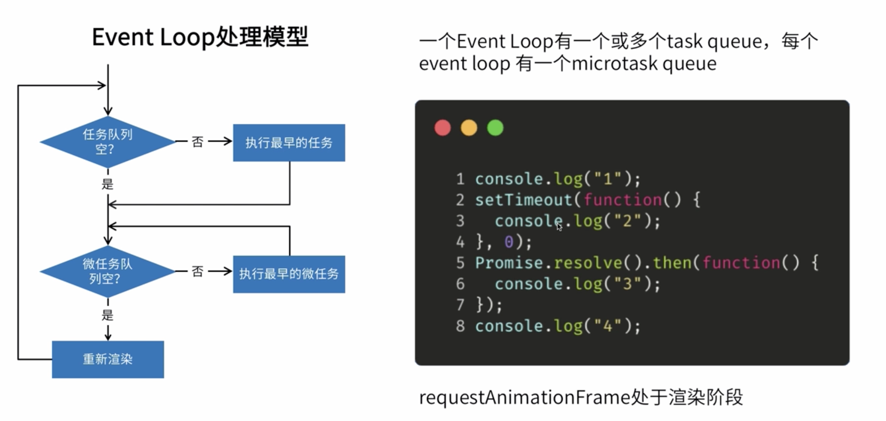

# 浏览器的Eventloop

##### 1.宏微任务

##### 2.理解

1.事件循环3大块，执行栈、多线程处理、任务队列

2.执行栈处理同步以及异步任务的回调，执行完就出栈（栈就是内存，存放js基础类型、地址引用、以及函数的调用，遵循先进后出）

3.任务队列分微宏两个任务，有人理解宏任务是在下一次事件循环的开头执行也没错。

​	3.1宏任务特征：有明确的异步任务需要执行和回调，需要其他异步线程支持。比如http请求需要异步的http线程

​	3.2微任务特征：没有明确的异步任务需要执行，只有回调，不需要其他异步线程支持。比如promise.then，只处理了回调而且由V8引擎来完成，并不需要其他线程来支持。从某些角度来说的话promise.then微任务并没有多线程的参与，都算不上是一个异步任务，只是书写代码的顺序修改了而已，放在了最后面。

4.js引擎线程处理js代码，而其他线程处理的是任务：定时器、http请求、事件触发，都有专门的线程处理