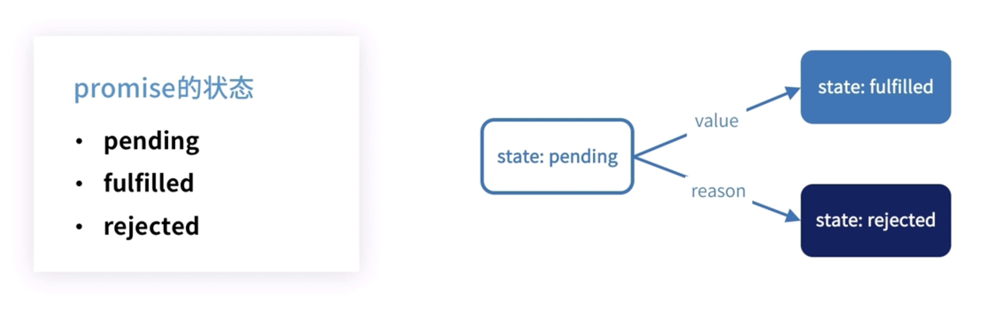
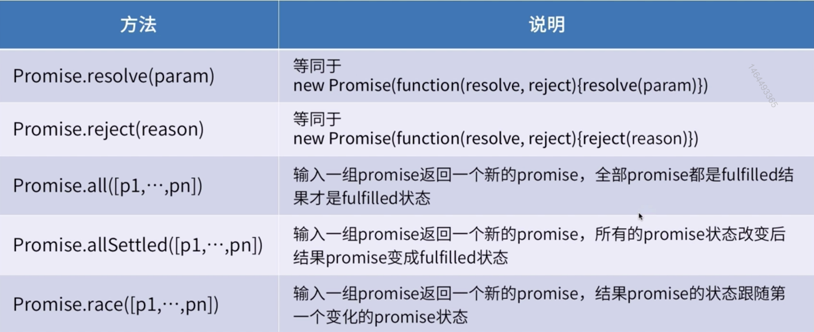
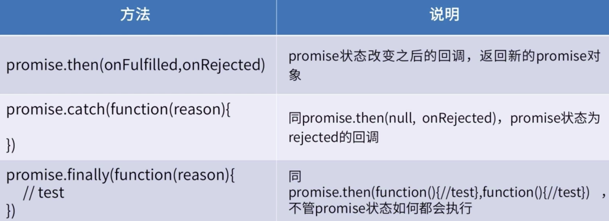
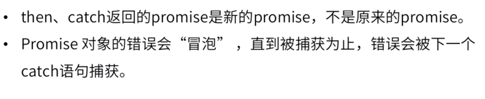

# PromiseA+规范

##### 1.术语


##### 2.要求

2.1**要求一**：一个 `promise`的状态被改变以后就不能再改变了



2.2 **要求二**： `promise`要有一个`then`方法，而`then`方法需要有一定的条件。


​	2.2.1 `then`的参数是两个函数，也可以不是函数（那会被直接忽略掉）

​	2.2.2 `then`可以通过链式被多次调用，每次都会返回一个`promise`实例，而这个实例里必须有`then`方法

​	2.2.3 `promise`实例里面每次被注册的`onFulfilled`和`onReject`将会按照被注册的顺序一一被执行，最后`then`方法会返回一个`promise`（值和状态）

2.3 `promise`解析过程（这里很复杂）


​	x是then参数返回的值

​	

##### 3.ES6 Promise API

3.1 静态方法

​	第一组，resolve相当于直接指定了`Promise`的状态为成功

​	第二组，reject相当于直接指定了`Promise`的状态为失败

​	第三组，all当所有的`Promsise`状态为成功才返回成功，只要其中一个状态为失败，那最后就返回失败

​	第四组，allSettled当所有的`Promsise`状态发生改变以后，不管成功还是失败最后都返回成功

​	第五组，race返回的结果以完成最快的`promise`的状态为准



3.2 `Promise`实例方法



##### 4 注意点



##### 5 实践

不要忘记catch捕捉错误，window上我们可以通过onerror来捕获错误，但是promise的错通过windows上的onerror监听不到，所以用catch。

then方法中使用return，return一个值就是promise的value，因为我们希望下一步的promise要知道上一步的promise的值是什么，这样不容易出错

传递函数给then方法，传其他的没有多大的意义（了解其原因请参考promise/A+规范）

不要把promise写成嵌套，因为这样又回到了之前的地狱回调，失去了promise的意义。

##### 6 总结

**注意1：promise最大的两块就是then方法和promise决议过程，要结合手写promise代码查看本文总结**

**注意2：then里的回调一般处理的都是异步，所以在手写promise里用setTimeout来模拟**

1.一个promise的状态被改变以后不能再次被更改，因为再去指定同一个promise的状态会被直接return结束。

2.resolve和reject可以直接指定当前promise的状态，不管是实例化里resolve回调方法的调用，还是Promise.resolve

3.promise中的函数参数`function(resolve, reject)`和`then(onFulfilled, onRejected)`有着差不多的意思。

​		3.1 then里的回调执行要考虑当前promise的状态后，再去执行对应的方法解析，比如当promise.state的状态是fulfilled时候，就执行resolve对应的方法（理解为promise解析过程）。

​		3.2 如果是promise里function(resolve, reject)中的回调执行，不用考虑promise的状态。

​		3.3 resolve和reject入参，以及`then(onFulfilled, onRejected)`形参的回调入参，决定了promise的状态

4.then方法可以被链式调用，但是当promise为pending时，then里的回调无法被调用执行

```js
/*
（如下部分可看可不看，在手写promise部分有全部代码）

 promise类：promise的状态、值、失败原因、成功队列、绝对队列的初始化

 resolvePromise ：promise的解析，为提供的值创建一个新的已解析的promise。

 fulfilledPromise ：只能从pending状态转换为其他状态

 rejectedPromise ：只能从pending状态转换为其他状态

 then：返回新的promise，状态通过then里的回调返回值确定

 isFunction、isObject、isPromise：大多用于resolvePromise 执行时，对于x入参的校验，以及then的入参校验


// then的参数
// 两个参数：onFulfilled, onRejected

	第一步：const promise1 = this; // 当前promise实例
	
    第二步：const promise2 = new Promise(() => {}); // 新创建的promise，所以then方法会返回新的promise
    
    第三步：校验当前使用then方法的promise的状态，通过状态判断该执行哪一步状态（pending、fulfilled、rejected）的方法解析，比如当promise1.state的状态是fulfilled时候，就执行resolvePromise 方法
    
    第四步：关于then方法里的形参onFulfilled, onRejected。拿onFulfilled来说，如果该参数不是一个函数直接返回promise1
    如果是一个函数时，首先将onFulfilled的返回值赋值为x，并交给resolvePromise方法去处理。注意这里onFulfilled(promise1.value)的形参，就是当前promise的值，所以在应用里我们能在回调中拿到promise的value
    const x = onFulfilled(promise1.value);
    resolvePromise(promise2, x);
*/
```

