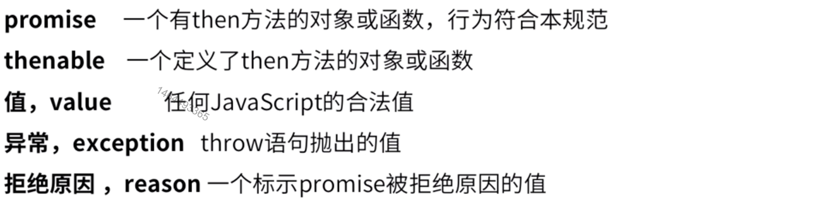
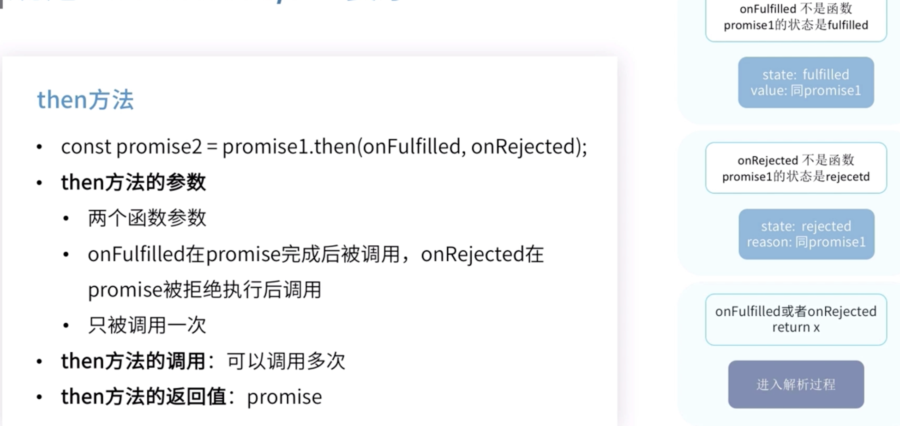

# Promise

##### 1.术语

##### 2.要求

2.1**要求一**：一个 `promise`的状态被改变以后就不能再改变了

2.2 **要求二**： `promise`要有一个`then`方法，而`then`方法需要有一定的条件。

​	2.2.1 `then`的参数是两个函数，也可以不是函数（那会被直接忽略掉）

​	2.2.2 `then`可以通过链式被多次调用，每次都会返回一个`promise`实例，而这个实例里必须有`then`方法

​	2.2.3 `promise`实例里面每次被注册的`onFulfilled`和`onReject`将会按照被注册的顺序一一被执行，最后`then`方法会返回一个`promise`（值和状态）

2.3 `promise`解析过程（这里很复杂）

​	x是then参数返回的值

​	

##### 3.ES6 Promise API

3.1 静态方法

​	第一组，resolve相当于直接指定了`Promise`的状态为成功

​	第二组，reject相当于直接指定了`Promise`的状态为失败

​	第三组，all当所有的`Promsise`状态为成功才返回成功，只要其中一个状态为失败，那最后就返回失败

​	第四组，allSettled当所有的`Promsise`状态发生改变以后，不管成功还是失败最后都返回成功

​	第五组，race返回的结果以完成最快的`promise`的状态为准

3.2 `Promise`实例方法

##### 4 注意点

##### 5 实践

不要忘记catch捕捉错误，window上我们可以通过onerror来捕获错误，但是promise的错通过windows上的onerror监听不到，所以用catch。

then方法中使用return，return一个值就是promise的value，因为我们希望下一步的promise要知道上一步的promise的值是什么，这样不容易出错

传递函数给then方法，传其他的没有多大的意义（了解其原因请参考promise/A+规范）

不要把promise写成嵌套，因为这样又回到了之前的地狱回调，失去了promise的意义。

