# Generator函数

`Generator`可以理解为`生成器`，`Generator` 函数是 `ES6` 提供的一种异步编程解决方案，语法行为与传统函数完全不同。

##### 一、迭代器

执行createIterator函数返回一个对象并赋值给iterator

iterator调用next方法

下图是用es5手写的一个迭代器

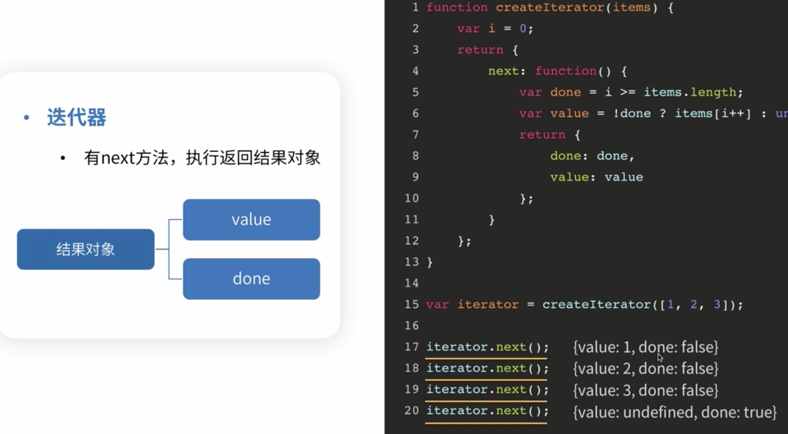

##### 二、两个协议

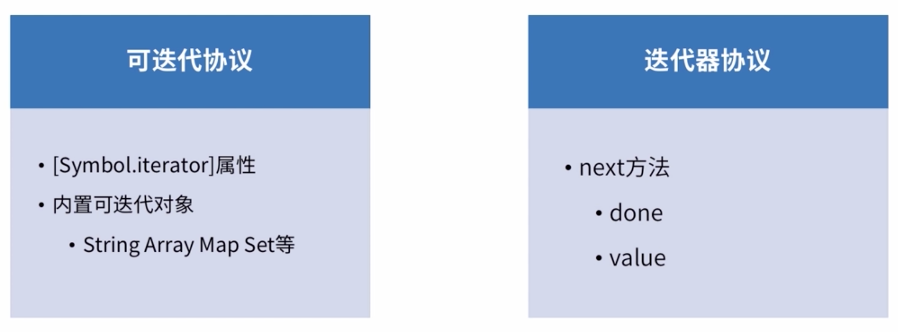

##### 三、ES6的Generator函数

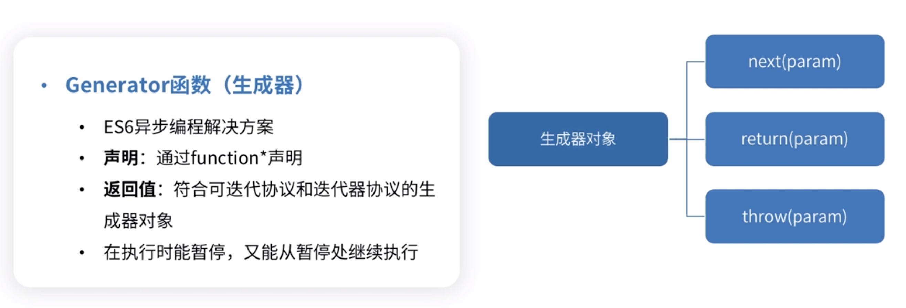

###### 3.1 yield关键字

###### 3.2 next方法

注意：如果遇到`yield*`不会暂停

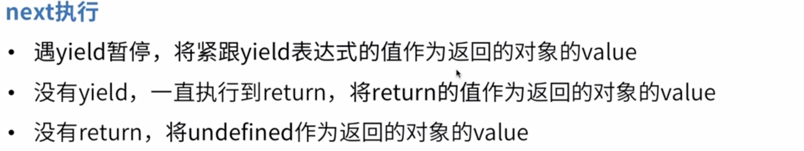

###### 3.3 next参数

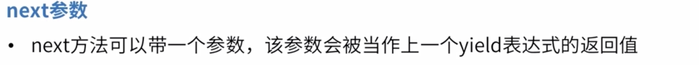

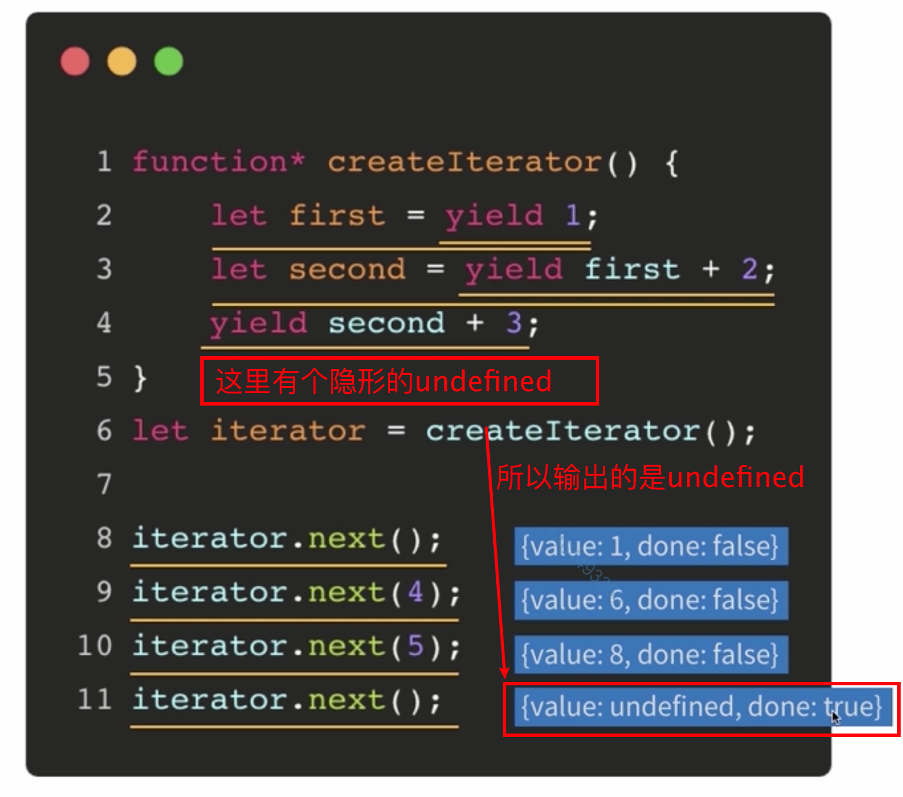

###### 3.4 yield*（交出控制权）

`yield`生成器函数/可迭代对象

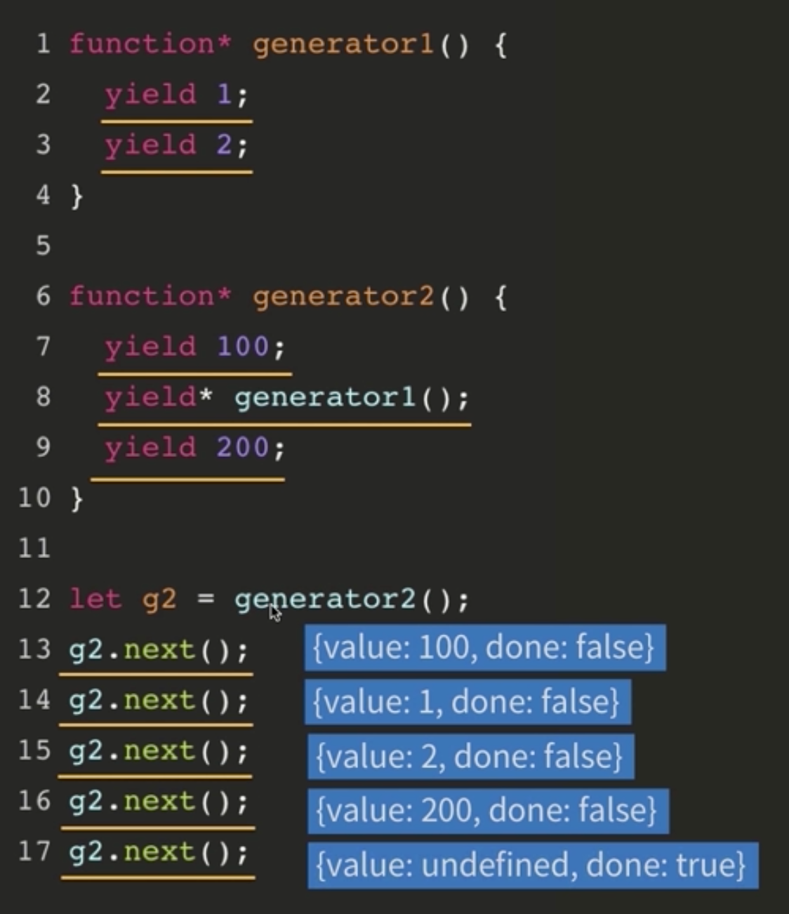

###### 3.5 return方法

`return`方法可以提前结束遍历器

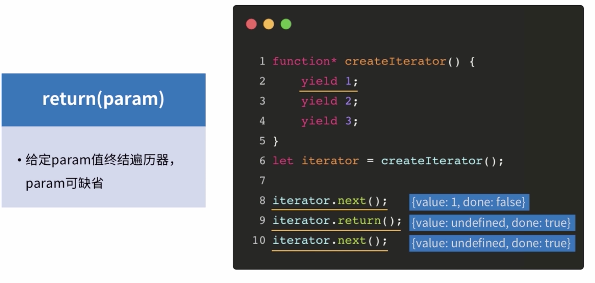

###### 3.6 throw方法

注意：`throw`方法遇到yield也可以停下来

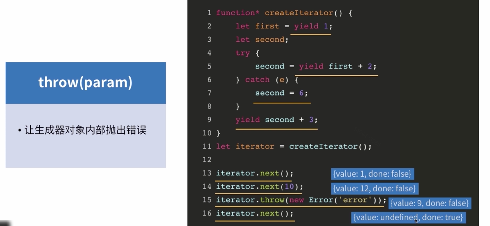

##### 四、Generator函数的实现原理

###### 1.[协程](https://cnodejs.org/topic/58ddd7a303d476b42d34c911  )

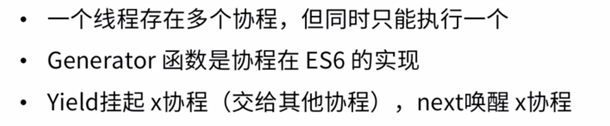

##### 五、Generator函数应用

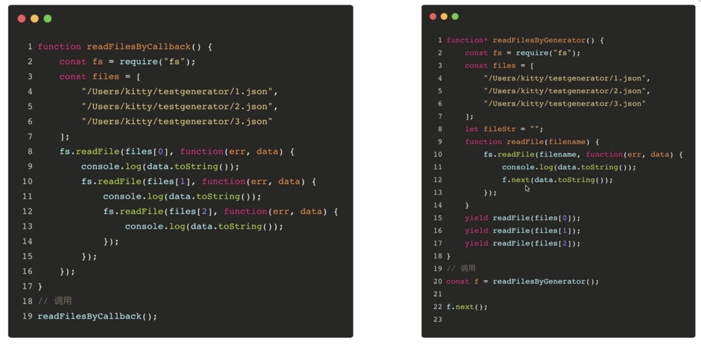

##### 六、[Thunk函数](http://www.ruanyifeng.com/blog/2015/05/thunk.html)

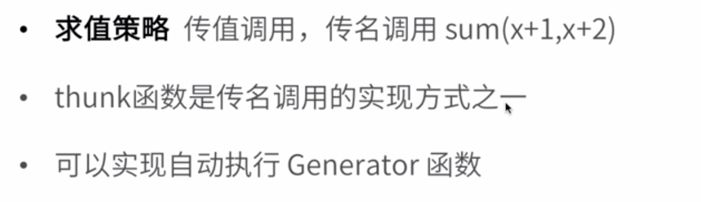

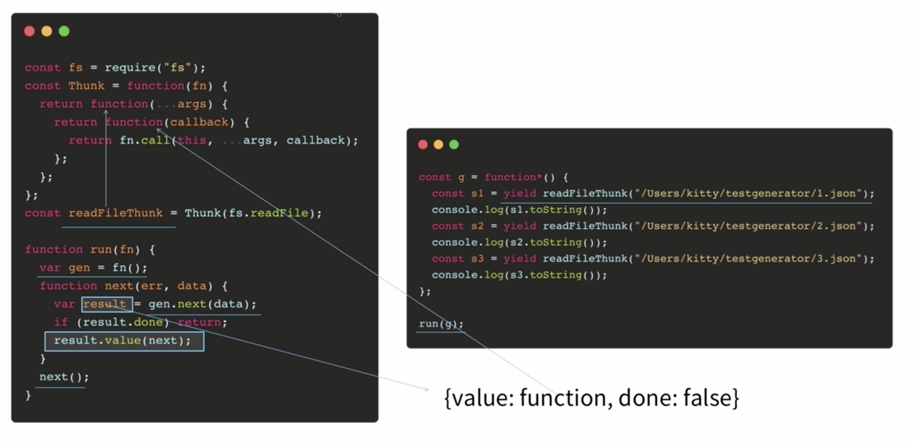

##### 七、co

7.1 [co 函数库的含义和用法](http://www.ruanyifeng.com/blog/2015/05/co.html)：**函数库其实就是将两种自动执行器（Thunk 函数和 Promise 对象），包装成一个库。**使用 co 的前提条件是，Generator 函数的 yield 命令后面，只能是 Thunk 函数或 Promise 对象。

7.2 [co模块源码](https://github.com/tj/co)