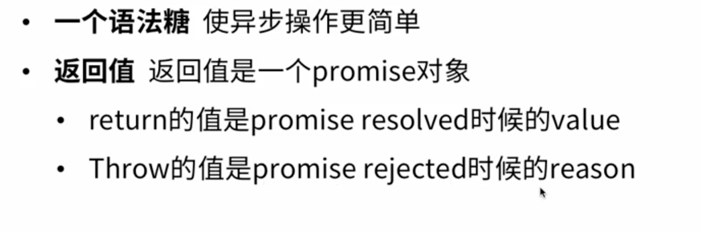
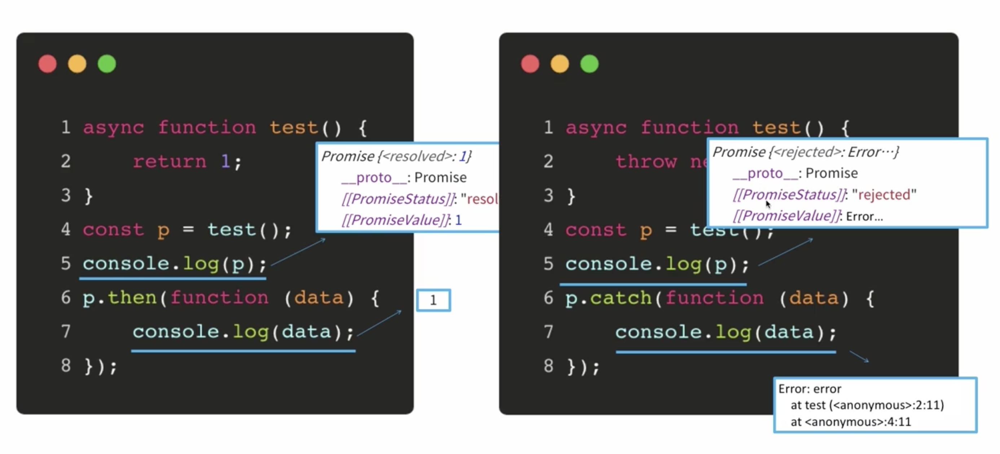
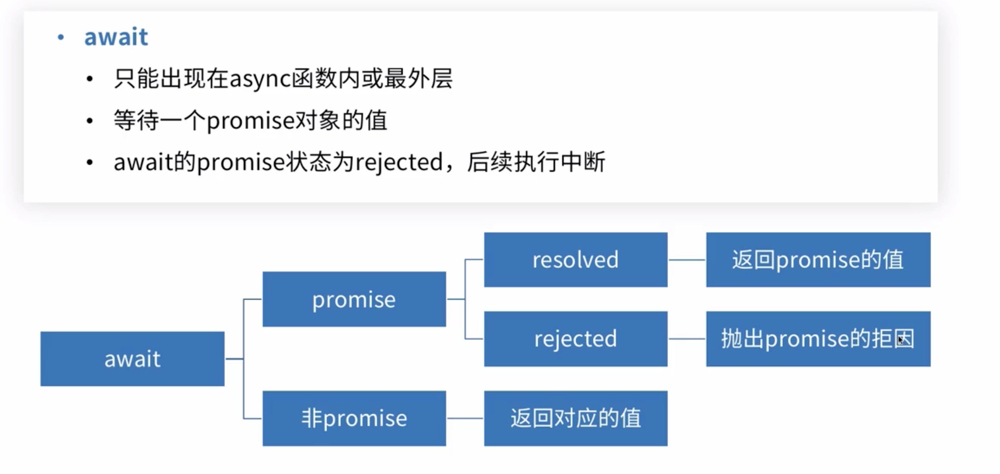
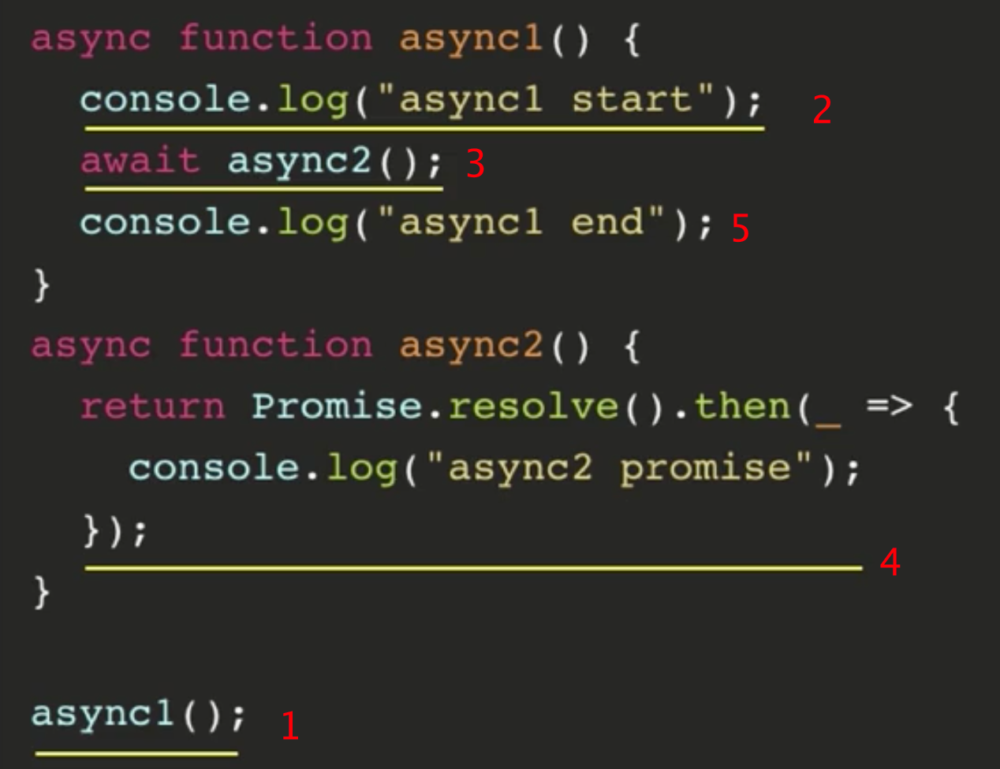
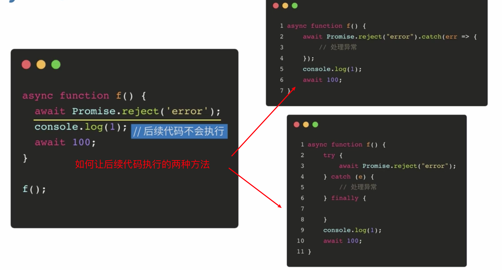
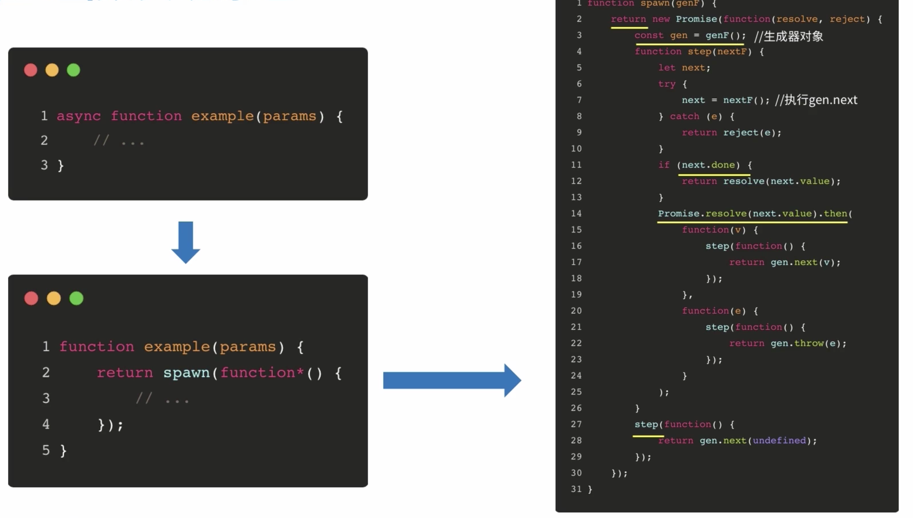
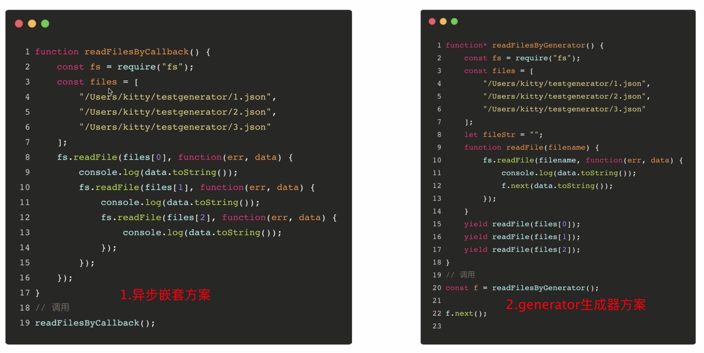
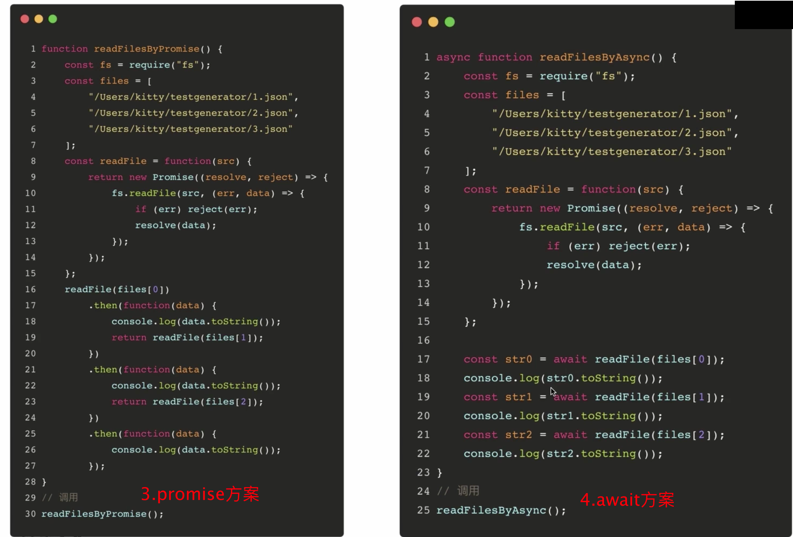

# async函数

##### 一、async

##### 二、await

2.1 await 在js的最外层可以用

2.2 await 在async可以用

2.3 await如果在普通函数里用会报语法错误

2.4 等待一个promise对象的值

2.5 await的promise状态为rejected，后续中断

##### 三、async实现原理

实现原理：Generator+自动执行器

##### 四、应用

题目：按顺序打印多个文件

