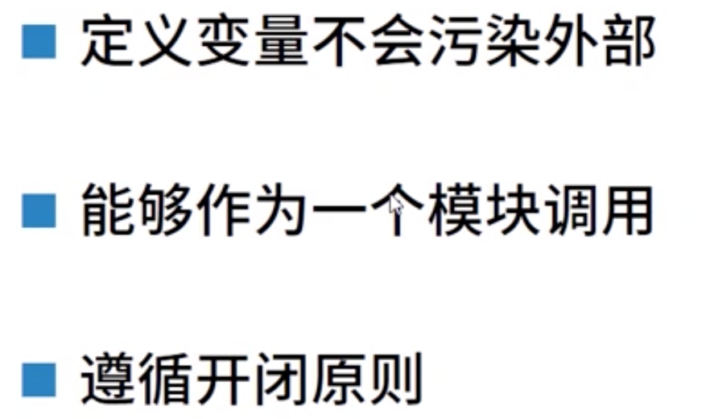
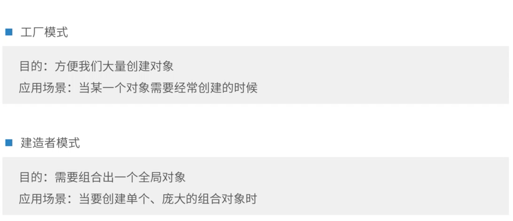
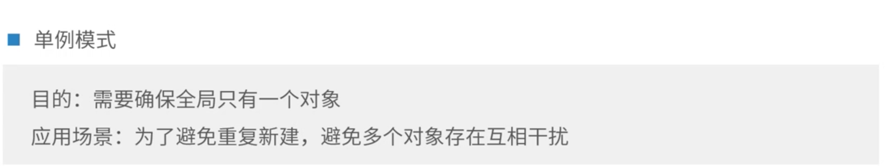
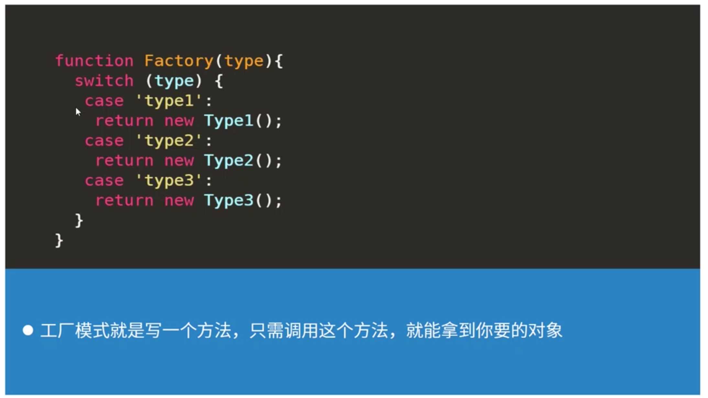
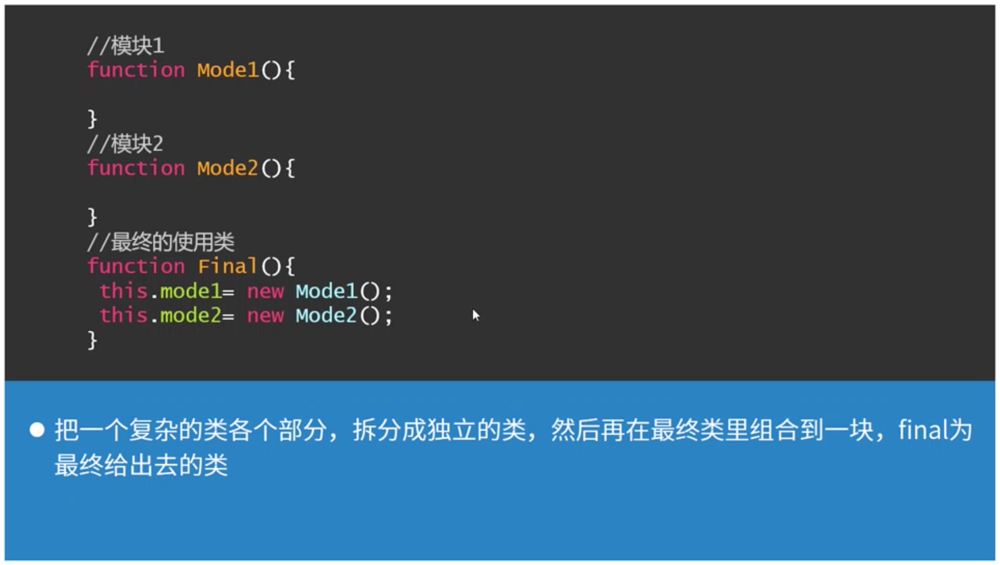
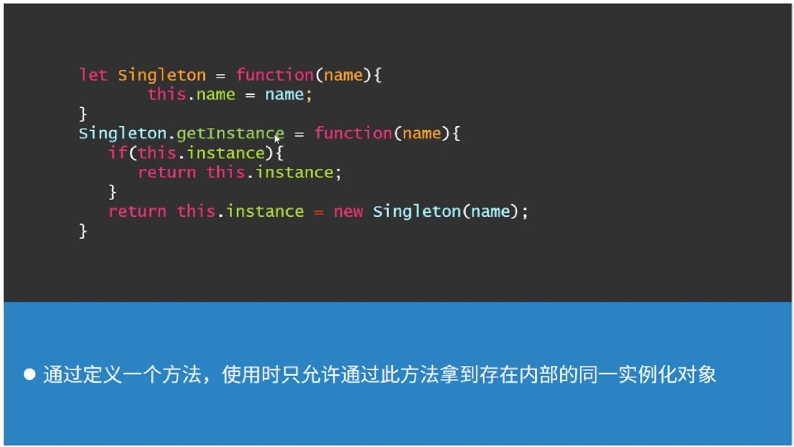

# [封装与对象](https://course.study.163.com/480000006851431/lecture-480000037171630)

用设计模式里的创建型去封装对象

##### 一、封装目的

##### 二、什么是好的封装

1.变量外部不可见

2.调用接口使用

3.留出扩展接口

##### 三、创建一个对象的模式

##### 四、保障对象只有一个

##### 五、创建型里的3种设计模式

1.基本结构

​	1.1工厂模式的基本结构

​	

​	2.2建造者模式的基本结构

​	

​	2.3单例模式的基本结构

​	