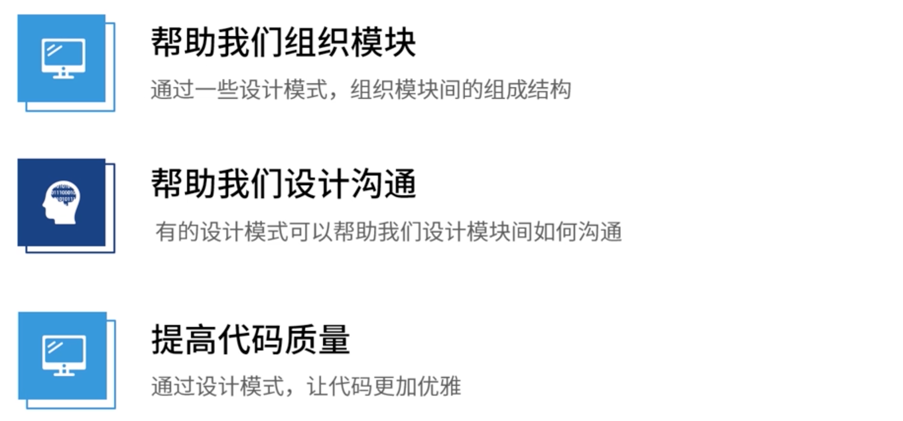
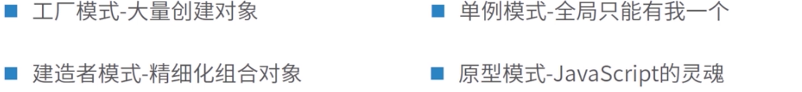
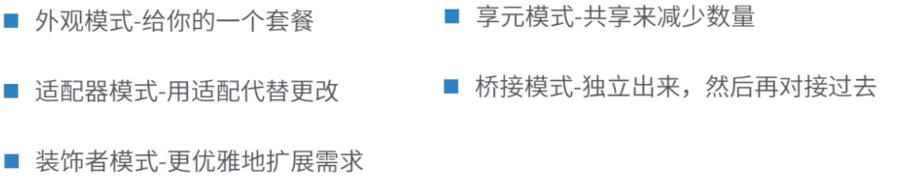
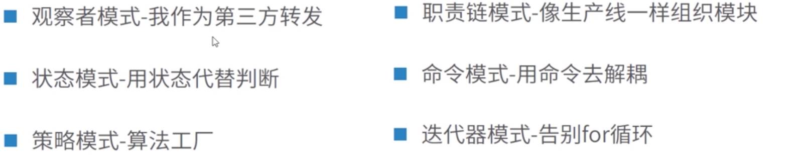
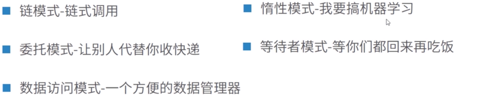

# [代码与设计模式](https://course.study.163.com/480000006851431/lecture-480000037172583)

问：我们写代码在写些什么？

答：项目 = 模块 + 沟通

设计模式扮演的角色：如下图所示

##### 一、设计原则

1.开闭原则

​	提供扩展接口，封装代码不让外部修改，但可扩展。如vue、react框架

2.单一职责原则

​	我们的模块只做一件事

3.依赖倒置原则

​	上层模块不依赖于下层模块，应该依赖于抽象

4.接口隔离原则

​	一个接口不要依赖太多的方法，单一化

5.迪米特法则

​	两个对象之间没必要直接沟通，不需要过多的了解调用方式，两者之间不需要了解太多，通过中间来转达

6.里氏替换原则

​	子类必须保证继承父类的所有属性和方法，这样父类使用的地方就能够用子类进行替换

##### 二、设计模式分类

设计模式四大类

1.创建型

2.结构型

3.行为型

4.技巧型

