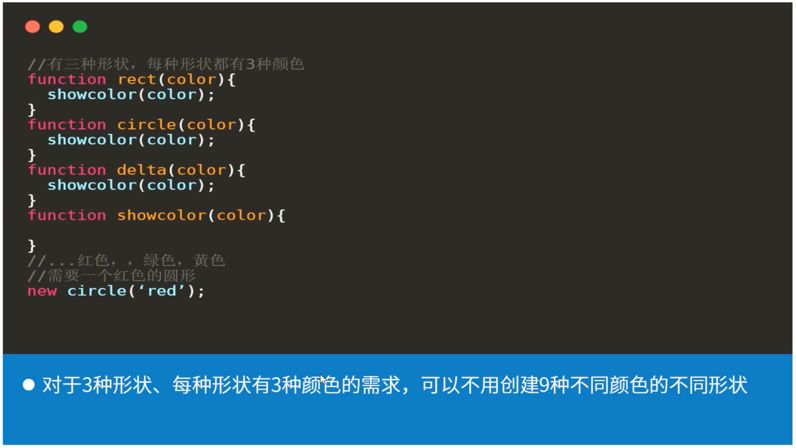
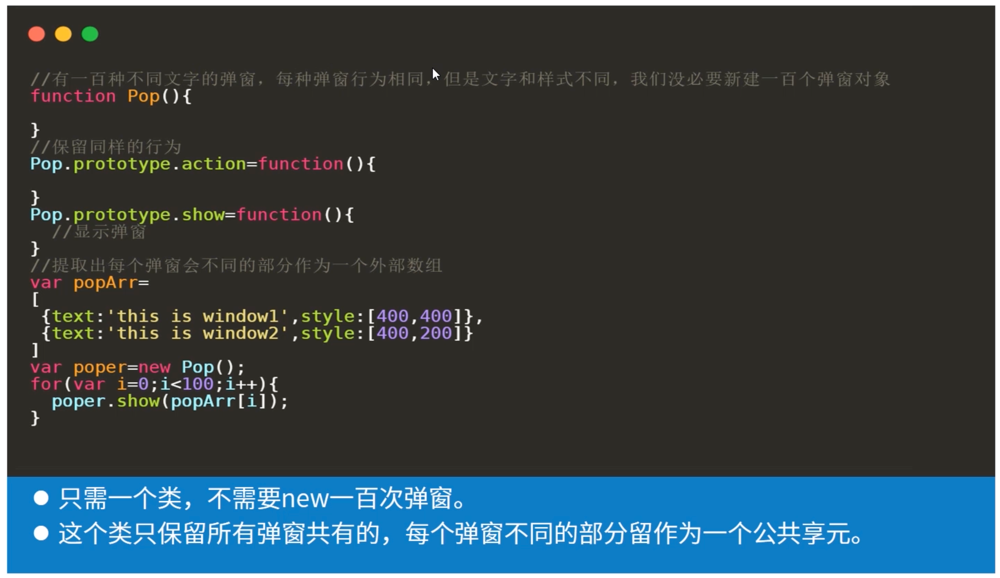
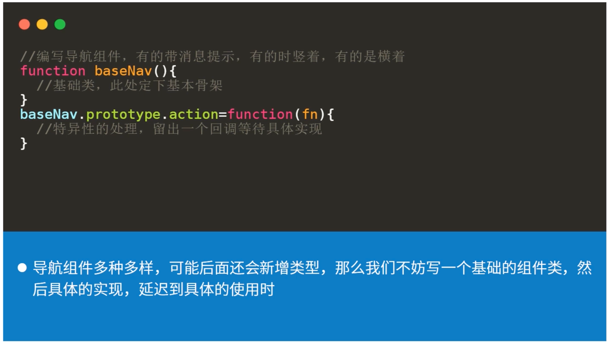

#### 一、提高复用性

##### 1.提高复用的目的

1. 遵循DRY原则
2. 减少代码量，节省开销

##### 2.复用性特点

1. 对象可以重复使用，不用修改
2. 重复代码少
3. 模块功能单一

##### 3.提高复用的三种模式

###### 桥接模式

目的：通过桥接代替耦合

应用场景：减少模块之间的耦合

###### 享元模式

目的：减少对象/代码数量

应用场景：当代码中创建了大量类似对象和类似的代码块

###### 模版方法模式

目的：定义一系列操作的骨架，简化后面类似操作的内容

应用场景：当项目中出现很多类似操作内容

#### 二、JavaScript的组合与继承

##### 1.组合

> JavaScript最初没有专门的继承，所以最初JavaScript推崇函数式编程，然后进行统一组合桥接到一起
>
> 桥接模式可以看出组合的一种体现，组合的好处是低耦合，方便方法复用，方便扩展
>
> 弊端是不能像继承一样自动继承父类的一切方法和属性

##### 2.继承

> 在es6出现class和extend，继承的方式多种多样，但是都是各有利弊
>
> 模板方法模式可以看出继承的一种体现，继承的好处是可以自动获得父类的内容与接口，方便统一化
>
> 弊端是当父类属性或方法修改以后，子类也随之被改变

#### 三、复用模式与对象封装

##### 1.桥接模式与工厂封装

代码复用的桥接模式与对象封装的工厂模式非常相似，但是前者是现实功能，后者是封装对象。

##### 2.享元模式与建造封装

代码复用的享元模式与对象封装的建造模式非常相似，但是前者是现实功能，后者是封装对象。

#### 四、总结

##### 1.桥接模式

通过独立方法间的桥接来形成整体功能，这样每个方法都可以被高度复用

##### 2.享元模式

提取出公有部分与私有部分，私有部分作为外部数据传入。从而减少对象数量

##### 3.模板方法模式

当一个功能朝着多样化发展，不妨先定义一个基础的，把具体实现延迟到后面