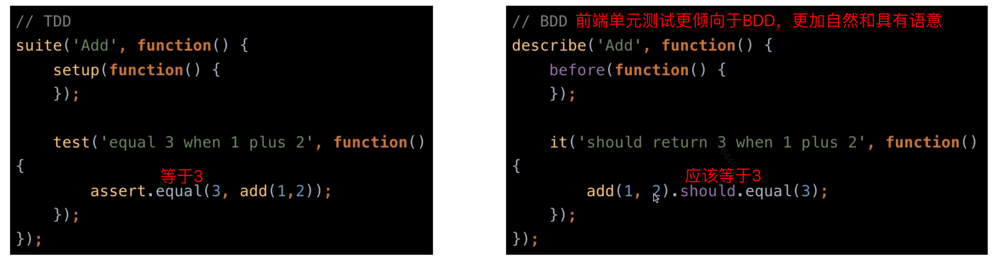
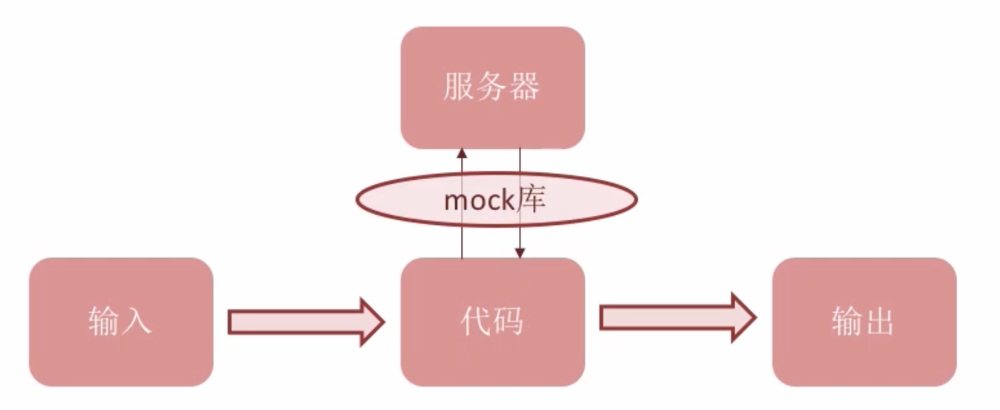

#### 一、单元测试

##### 1.什么是测试

测试是指在规定的条件下对程序进行操作，现程序错误，衡量软件质量，并对其是否满足设计要求进行评估的过程。

`补充：测试用例，测试用例是为某个特殊目标而编制的一组测试输入、执行条件以及预期结果，以便测试某个程序路径或核实是否满足某个特定需求。输入 >>> 执行条件 >>> 预期结果`

##### 2.什么是单元测试

对软件最小可测试单位进行检查和验证。

##### 3.测试维度

API、函数、功能、系统

> 在上述四个维度当中，API和函数就属于单元测试的测试维度。因为功能比较复杂，不属于最小可测试单位，系统就更不用说了。

##### 4.测试分类

功能/非功能测试、动态/静态测试、黑盒测试、白盒测试、灰盒测试...

##### 5.单元测试的开发方法（怎么测）

1. TDD
   - 关注点：代码实现逻辑
   - 测试驱动开发
   - 从实现的角度
   - 需求分析 ➡️ 编写单元测试 ➡️ 编写代码使单元测试全部通过 ➡️ 重构并重复测试
2. BDD
   - 关注点：业务实现逻辑
   - 行为驱动开发
   - 基于行为，更自然，更贴近需求描述
   - 从业务角度定义具体可衡量目标 ➡️ 找到可实现目标的方法 ➡️ 编写单元测试 ➡️ 实现行为 ➡️ 检验产品运行结果是否符合预期

##### 6.写单元测试的意义

1. 保证单元的质量
2. 驱动开发
3. 指导设计
   - 逻辑不清、需求不清、职责不清的代码是不可做测试的，在写单元测试的过程中能指导我们的代码该如何设计
4. 隔离和定位错误
   - 每个单元测试都是测的最小单元，一旦用例执行失败，就很容易定位到
5. 保证重构、升级
   - 如果单元测试全部通过，那么代码是可靠的，可靠的代码能方便重构
6. 自动化
   - 解放传统的、重复的人工手动测试

#### 二、单元测试技术

> 平常我们都会输出log日志来看内容，那也只是我们想看的，并没有进行计算机分析，只是人为的大脑比较结果。
>
> 完整单元测试分为：被检测方法 ➡️ 数据&&外部依赖 ➡️  执行方法 ➡️  检查结果。其中第二步就是mock&&stub，第四步就是断言。这么粗略的一看，单元测试关注的点还是很多的。那么单元测试框架就是帮我们解决这些附属的工作（mock、stub、断言...），屏蔽测试逻辑以外的东西，让我们更关注测试逻辑的实现。

##### 1.测试框架

Qunit、jasmine、mocha、intern

##### 2.断言库

chai、should、expect、assert

##### 3.mock库

sinon

mock情景举例：我们的代码在输入输出的过程中，还会跟服务器进行交互，那么服务器返回状态结果的不同，致使原有的测试逻辑受到不稳定的干扰，所以跟服务器进行交互的部分就需要mock

> 

##### 4.test runner

karma、buster.js

提供执行环境，管理执行流程

##### 5.覆盖率工具

Istanbul

Istanbul-伊斯坦布尔是土耳其最大的城市，而他世界闻名的就是地毯，而地毯本身就是覆盖的意思，所以取名Istanbul

覆盖率一般常见的有：

- 行覆盖率
  - 保证每行都被覆盖
- 函数覆盖率
  - 保证每个函数都被覆盖
- 分支覆盖率
  - 保证每个分支都被覆盖
- 语句覆盖率
  - 保证每个语句都被覆盖

#### 三、如何写好单元测试

基于3点，可靠、可维护、可读

##### 1.可靠性

- 及时修改和维护
- 避免测试中逻辑过多
- 只测试单一的点
- code review
- 独立运行
- 充分考虑边界条件
- 数据模拟尽量贴近真实

##### 2.可维护性

- 测试公有方法
- 移除重复代码
- 保证setup方法的可维护性
- 测试隔离，不允许互相依赖
- 单个测试中避免多个断言

##### 3.可读性

- 命名问题
- 有意义的断言
- 断言与操作分离

#### 四、前端测试用例分类

数据层、逻辑层、展示层、工具层