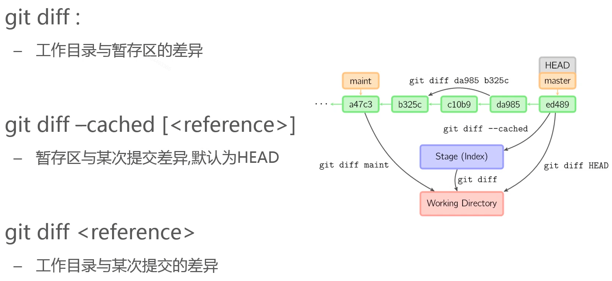
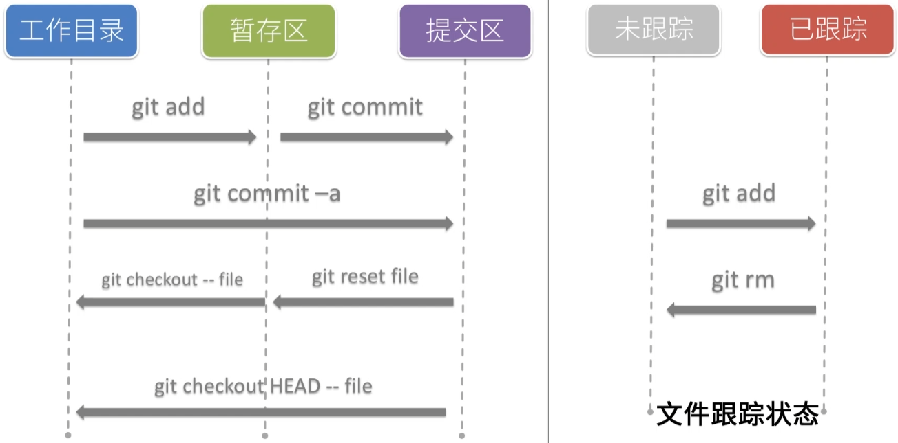
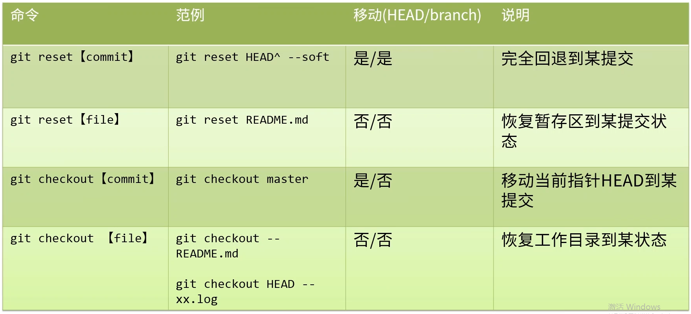

### 版本管理

#### 一、版本管理概述

##### 1.版本控制系统

- 是一种记录若干文件修订记录的系统
- 能帮我们查阅某个历史版本

##### 2.为什么要了解版本管理

搞代码开发的你不了解一下你搞毛

##### 3.不同版本的版本控制系统

- “人肉”VCS
- LVCS 本地式
  - 优点：需要哪个版本就取哪个
  - 缺点：多人协作就不行了，因为是本地数据库维护
- CVCS 集中式（代表：SVN）
  - 优点：管理的记录都在服务器
  - 缺点：网络请求的流程性，如果服务器奔溃，轻则无法对仓库代码进行操作，重则丢失修改记录
- DVCS 分布式（代表：git）
  - 优点：每一份本地拷贝都是完整的历史拷贝。即使中央服务器出现故障，我们也能完成还原出来

#### 二、git操作

##### 1.什么是git

- git是免费开源的分布式版本控制系统（DVCS）
- git是一个基于内容寻址的存储系统

##### 2.git历史

- git的出现离不开Linux，
- 1991-2002之间几乎无版本控制
- 2002-2005：BitKeeper
- 但是Bitkeeper与Linux之间不知道啥原因决裂了，随后Linux的作者自己来做版本控制系统（git）
- 2005-至今

##### 3.git优势

- 快，不依赖于网络请求（指的是分布式版本管理）
- 完全分布式
- 轻量级的分支操作
- git已经成为现实意义的标准
- 社区活跃度高

##### 4.安装

- mac：brew install git（只举例mac系统）
- git也有可视化程序操作、命令行操作

##### 5.git命令

git有数以百计的命令，不需要全部记住，可以勤查文档

###### -1 git config

- 用户配置
  - git config --global user.name "Tom"
  - git config --global user.email "tom@gmail.com"
- 配置级别
  - --local 【默认，高优先级】：只影响本仓库   ` .git/config`
  - --global【中优先级】：影响所有当前用户的git仓库   ` ~/.gitconfig`
  - --system【低优先级】：影响到全系统的git仓库  `/etc/gitconfig`

###### -2 git init

> 初始化仓库

###### -3 git status

查看内容状态和文件状态之间，现在所处的关系

> 内容状态：工作目录、暂存区、提交区
>
> 文件状态：已跟踪、未跟踪

###### -4 git add

添加文件到暂存区（并标记已跟踪）

> `git add <file>` 添加某个文件
>
> `git add .` 添加所有文件

###### -5 .gitignore

忽略文件,（github/gitignore）里可查看各类型文件的忽略示例、规范

> 在添加时忽略匹配文件
>
> 仅作用于未追踪文件

###### -6 git rm

从暂存区删除

###### -7 git commit

根据暂存区内容提交一个记录，**并且HEAD/branchName会向前移动**

> `git commit -m"feat(indx): first commit"`
>
> 如果你不想git add这一步，那么可以直接 `git commit -a -m"feat(indx): first commit"`

###### -8 git log

显示提交历史

> `git log`
>
> `git log --oneline`

###### -9 git diff

显示不同版本差异

> 

###### -10 git checkout -- <file>

撤销本地修改（将文件内容从暂存区复制到工作目录）

> `git checkout -- <file>`

###### -11 git reset HEAD  <file>

撤销暂存区（将文件内容从上次提交复制到暂存区，也相当于清空了暂存区）

> `git reset HEAD  <file>`

###### -12 git checkout HEAD -- <file>

将文件内容从上次提交复制到工作目录，也相当于撤销所有暂存和文件目录改动

> `git checkout HEAD -- <file>`

###### -13 小结

##### 6.分支操作

###### -1 git branch

分支的增删改查都靠它

git分支轻量级的秘密就是，它的引用就是一个文本文件，可通过 `cat .git/refs/heads/master`查看，里面就是40多位的字符集编码。

> `git branch <branchName>`
>
> `git branch -D <branchName>`
>
> `git branch -v`
>
> `git branch -a`
>
> `git branch`

###### -2 git checkout

通过移动HEAD检出版本，可用于分支切换

> `git checkout <branchName>` 移动HEAD/branchName
>
> `git checkout -b <branchName>`  移动HEAD/branchName
>
> `git checkout <commit>` 移动HEAD，不移动branchName，**但是所有的提交没有引用，只用于查看**，也就是说当**HEAD与分支引用分离**的时候不要做add和commit操作

###### -3 git checkout -

移动到上一个分支

> `git checkout -`

###### -4 git reset

将当前分支回退到历史的某个版本

> `git reset --mixed <commit>` --mixed默认的，不传也行(撤销commit，撤销git add，回到工作目录)
>
> `git reset --soft <commit>` (撤销commit，不撤销git add，回到暂存区)
>
> `git reset --hard <commit>`(撤销commit，撤销git add，还原改动的代码)
>
> `git reset --mixed HEAD~1` 撤回最近一次的commit(撤销commit，撤销git add)
>
> `git reset --soft HEAD~1` 撤回最近一次的commit(撤销commit，不撤销git add)
>
> `git reset --hard HEAD~1` 撤回最近一次的commit(撤销commit，撤销git add,还原改动的代码)

###### -5 git reflog

查看经历过的所有commit，比如当回退过某一个commit，那这个commit就在最前面

> `git reflog`

###### -6 reset vs checkout

reset 和 checkout区别就是对于commit和file的操作从而产生对HEAD和branch的操作

###### -7 git stash

> `git stash save 'context'` 保存当前分支的工作目录和暂存区内容，常用于未开发完且需要切换分支时
>
> `git stash list` 查看当前分支保存了那些保存的工作目录和暂存内容
>
> `git stash apply stash@{0}` 取出第一个stash记录
>
> `git stash drop stash@{0}` 删除第一个stash记录
>
> `git stash pop` 相当于是 stash apply + stash drop，取出第一个然后删除掉stash记录

###### -8 git merge

合并分支

> 8.1从master上建立出了next分支，随后next和master都有commit记录， 当next分支合并到master上时，master需要再次保存提交一次产生新的commit记录，HEAD/master向前移动
>
> `git merge next`
>
> `git add .`
>
> `git commit -m"context"`
>
> 
>
> 
>
> 
>
> 8.2 通过下面命令我们看到，合并是发生在master上面的，next分支引用没有发生过变化，而master的引用位置指针（HEAD/master）发生了变化（向前移动），并且c4fe238指向两条分支的最新提交。当然，我们还可以用`git cat-file -p HEAD`命令来查看是否是指向了两条分支的最新提交
>
> `git cat-file -p HEAD`
>
> 

###### -9 合并冲突both modified

通过选择保留后，通过`git add .` && `git commit -m"context"`来解决冲突

###### -10 git merge --no-ff

保持master分支干净，不受到特性分支提交记录的影响

    $ git checkout master
    $ git merge feature
              A---B---C feature
             /         master
    D---E---F 
    
    ============================
    
    $ git checkout master
    $ git merge --no-ff feature
      A---B---C feature
             /         \
    D---E---F-----------G master
> 由于 --no-ff 禁止了快进，所以会生成一个新的提交，master 指向 G。
>
> 从合并后的代码来看，结果其实是一样的，区别就在于 --no-ff 会让 Git 生成一个新的提交对象。为什么要这样？通常我们把 master 作为主分支，上面存放的都是比较稳定的代码，提交频率也很低，而 feature 是用来开发特性的，上面会存在许多零碎的提交，快进式合并会把 feature 的提交历史混入到 master 中，搅乱 master 的提交历史。所以如果你根本不在意提交历史，也不爱管 master 干不干净，那么 --no-ff 其实没什么用。不过，如果某一次 master 出现了问题，你需要回退到上个版本的时候，比如上例，你就会发现退一个版本到了 B，而不是想要的 F，因为 feature 的历史合并进了 master 里。

###### -11 git tag

对某个提交设置一个不变的别名，然后直接使用`git checkout tag`切换到某个commit，而不需要使用很长的字符编码

> 
>
> 

##### 7.远程操作

> git支持本地协议，所以我们可以初始化一个本地的远程服务...
>
> 中央服务不需要工作目录，他应该是个被动接受，同步你和你同事之间的分支操作，没有工作空间

###### -1 git init path/fileName --bare

初始化一个本地的远程服务（裸仓库）

> git init path/fileName --bare

###### -2 git push

提交本地历史到远程

> git push

###### -3 git remote

远程仓库配置操作

> `git remote add origin <你的项目地址>` 添加远程仓库
>
> `git remote set-url origin <remote-url> ` 修改远程仓库
>
> `git remote rm origin` 删除远程仓库
>
> `git remote -v` 仓库路径查询